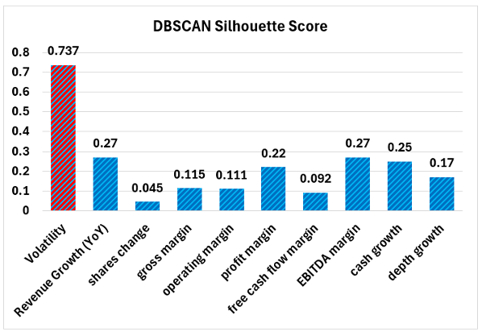

# ML based Portfolio Management with Macro-Financial Indicators
#### CS7641 Project - Group 11

# I. Introduction

## Literature Review

In rapidly evolving financial markets, traditional investment strategies are increasingly inadequate for risk management and return forecasting [1]. Research has highlighted the importance of macroeconomic influence on stock prices [2]. The lack of data and computing resources constrained the integration of machine learning into investment portfolio management. [3]. However, technological advancements now enable the inclusion of non-financial information such as macroeconomic trends and social media sentiment into predictive models [4][5].

## Dataset
- Federal Interest rate [Link](https://fred.stlouisfed.org/series/DFF)
- GDP  [Link](https://fred.stlouisfed.org/series/GDP)
- CPI  [Link](https://fred.stlouisfed.org/series/CPIAUCSL)
- Personal saving rate [Link](https://fred.stlouisfed.org/series/PSAVERT)
- Unemployment rate [Link](https://fred.stlouisfed.org/series/UNRATE)
- Stock Tweets: This dataset will be utilized for sentiment analysis and potential prediction.[Link](https://www.kaggle.com/datasets/equinxx/stock-tweets-for-sentiment-analysis-and-prediction)
- News Headlines (RSS Feeds): Tweets covering popular stocks will be analyzed to gauge sentiment.[Link](https://www.kaggle.com/datasets/shtrausslearning/news-trading/data)
- Daily Stock Prices (Yahoo Finance): Daily price data for a subset of S&P 500 stocks since January 2007 via the yfinance API.

# II. Problem Definition

## Problem

The efficacy of traditional portfolio management techniques solely depend on historical stock prices and basic financial indicators. These models fail to account for the broader economic context, resulting in inadequate portfolio allocations and higher risk exposure. To achieve near-perfect forecasts, it is imperative to build more sophisticated frameworks using wider ranges of data sources.

## Motivation:
The motivation behind this project stems from the potential for ML models to address the shortcomings of existing portfolio optimization approaches. By integrating macroeconomic indicators and possibly sentiment analysis into portfolio optimization, we aim to enhance the accuracy and robustness of investment strategies, allowing for better risk management and return maximization and providing investors with valuable insights into market dynamics.

# III. Methods

Collected datasets have different formats and intervals of records. The examples of preprocessing methodologies are listed below: 
- Interpolating missing data 
- Removing Outliers
- Data format standardization
- Merge features from multiple datasets
- Analyze and quantize sentiment data

We utilized supervised/unsupervised models useful for the time series datasets.
Our current models include K-means and DBSCAN clustering for unsupervised and
Autoregressive Integrated Moving Average (ARIMA) and Long Short Term Memory
Model (LSTM) for supervised. The stock data has been divided into two sets:
training data covering the period from 2018 to 2022, and test data for the year
2023.

We chose K-means particularly because it is simple and fast, and we did not feel
the need to obtain probabilities from a soft clustering model like GMM.  We plan
to use K-means primarily to analyse stock similarity, facilitating the selection
of stocks across various clusters to enhance portfolio diversification. Some
challenges that using a clustering algorithm like K-means poses for this,
however, is determining a proper distance function that accurately identifies
similarities between stocks.

We chose to implement DBSCAN for our other unsupervised learning method. We chose DBSCAN particularly because it is density-based and we don’t need to specify the number of clusters beforehand.  We plan to use DBSCAN to also analyse stock similarity and compare it to the performance of K-means. Like K-means, we also need to determine a proper distance function, but we also have to choose an optimal epsilon radius and minimum points per cluster.

We primarily utilized sklearn to train our K-means, PCA and DBSCAN models and for performance metrics for clustering, and we also utilized pandas and numpy for general data manipulation. 

To initially simplify data preprocessing, we limited our model to 2 features and
experimented with what we chose for the features, such as mean returns,
volatility, GDP growth, unemployment rate, etc. We mainly compared stocks via
mean returns and volatility, which is calculated via the mean and variance of
each stock’s percent change in value over the last 5 years. We chose mean
returns and volatility primarily because they were simple stock-specific
indicators. We also attempted to compare stocks via macro-economic indicators
such as GDP growth, unemployment rate, and CPI.

We also compared the performance of these chosen features to feature extraction
via PCA. We wanted to compare the manually selected features we chose to
machine learning methods of selecting features. We chose PCA specifically
because PCA is a popular unsupervised learning method of performing feature
extraction.

Through the elbow method, we confirmed that the most optimal number of clusters
without PCA was 3, and the optimal number of clusters with PCA was 4.

For K-means, we realized that our choice of macro-economic indicators such as
GDP, CPI, unemployment rate may not be the best candidates for features for
unsupervised clustering since these economic indicators don’t differentiate
between stocks. In an effort to utilize more stock specific economic indicators
to increase the performance of our clustering algorithm, we assessed the balance
sheet per stock as our feature data set. We manually scrapped the balance sheet
data from the following source [7]. Revenue Growth (YoY), shares change, gross
margin, operating margin, profit margin, free cash flow margin, EBITDA margin,
cash growth, and depth growth are utilized for clustering. None of the balance
sheet data outperformed the volatility in terms of silhouette score. The
comparison of the silhouette score is shown below:

One main reason volatility shows the best clustering is that the balance sheet
is less responsive to market changes than the volatility. In addition, the
balance sheet data could be influenced by how a company chooses to report its
finances, which causes noise in the data. Therefore, we primarily focused on
optimizing volatility for Kmeans. 

 
 

We explored using K-means to cluster 10 of most popular stock indices. Although
K-means doesn’t select stocks directly, we altered the algorithm to choose the
stocks with the minimum volatility for each cluster. We estimated our K-values
by seeing which datapoints on the graphs were closest to each other. Our K-means
algorithm for mean returns vs volatility for k=3 selected JPM, NVDA, and VOO,
and our K-means algorithm with PCA for k=4 selected JPM, NVDA, TSLA, and VOO.
Since PCA turned out to output quite similar results compared to mean returns vs
volatility, this confirmed our assumptions that mean returns and volatility were
good measurements to categorize stocks.

We utilized DBSCAN to improve silhouette score using a similar approach to
K-means. We chose the minimum number of points per cluster to be 3 since when we
plotted it out, we saw a group of 3 as the smallest cluster. We also estimated
the epsilon radius through the elbow method.

Through the elbow method, we found that the most optimal epsilon radius without
PCA would be somewhere between 1.25 and 1.5.

We assessed the silhouette scores for DBSCAN, using volatility and balance sheet
data, similar to our evaluation with K-means. Volatility consistently
outperformed balance sheet data, with scores at least 2.7 times higher. This
finding aligns with the results from our K-means analysis, further confirming
that volatility is highly sensitive to changes in stock prices.

Because volatility was the most sensitive to stock prices, we decided to also
cluster stocks for DBSCAN in terms of means returns vs volatility. It turns out
that an epsilon of 1.25 and 1.5 produces the exact same result, with two
selected clusters. Choosing stocks per cluster with the highest volatility, both
selected NVDA and VOO.

Unfortunately, PCA wasn’t as useful for DBSCAN. No matter what epsilon we chose,
applying PCA always resulted in a large number of clusters as outliers (denoted
as –1 in the plot below).

For the supervised learning aspect of our project, we opted for the ARIMA (Autoregressive Integrated Moving Average) model, renowned as one of the most widely used models for forecasting linear time series data. Its extensive adoption stems from its reliability, efficiency, and capability in forecasting short-term fluctuations in stock market movements.
ARIMA models are a popular tool in time series analysis, particularly in forecasting future values based on historical data. By incorporating lagged moving averages, ARIMA models provide a method to smooth out fluctuations and identify patterns in time series data. However, their reliance on past observations inherently assumes that future behavior will resemble the past, making them susceptible to inaccuracies in volatile market conditions like financial crises or during periods of rapid technological advancements. While ARIMA models offer valuable insights, it's essential to supplement their predictions with other analytical techniques and consider the broader economic and technological landscape for more robust forecasting in dynamic markets.
We conducted exploratory data analysis (EDA) on a selection of 10 ticker stocks, focusing on their adjusted closing prices from 2018 to 2024. Our EDA encompassed various aspects, including the visualization of stock volatility, daily returns, quarterly returns, annual returns, adjusted closing prices over the years, and a covariance matrix heatmap of portfolio returns. 

While preparing our data for modeling, we rigorously checked for seasonality and
stationarity, both crucial conditions for employing the ARIMA model. Seasonality, characterized by regular and predictable
patterns that repeat over a calendar year, can adversely impact regression
models. To ensure stationarity, a prerequisite for ARIMA, we employed
differencing techniques to remove trends and seasonal structures from the data.
The Augmented Dickey-Fuller (ADF) test emerged as a pivotal tool in our
analysis, widely employed in time series analysis for assessing stationarity [6].
This statistical test aims to determine the presence of a unit root within a
series, indicating non-stationarity. The test formulates null and alternative
hypotheses, with the null hypothesis positing the existence of a unit root, and
the alternative hypothesis suggesting its absence. Failure to reject the null
hypothesis indicates non-stationarity, implying the series may exhibit either
linear or difference stationary characteristics.

In addition to checking for seasonality and stationarity, we performed seasonal
decomposition to extract the underlying time series components, namely Trend and
Seasonality, from our data. To mitigate the magnitude of values and address any
growing trends within the series, we initially applied a logarithmic
transformation. Subsequently, we calculated the rolling average of the
log-transformed series, aggregating data from the preceding 12 months to compute
mean consumption values at each subsequent point in the series. Following data
preprocessing, we partitioned the dataset into training and testing subsets,
preserving the chronological order of observations to maintain the time-series
nature of the data.

For tuning the hyperparameters of the ARIMA model, denoted as a tuple (p, d, q),
we employed a systematic approach. Here, 'p' represents the number of
autoregressive terms, 'd' denotes the number of nonseasonal differences, and 'q'
signifies the number of lagged forecast errors in the prediction equation. To
determine suitable values for 'p' and 'q', we analyzed autocorrelation and
partial autocorrelation plots. Specifically, we utilized the partial
autocorrelation function (PACF) plot to identify the value of 'p', as the cutoff
point in the PACF plot indicates the autoregressive term. Conversely, the
autocorrelation function (ACF) plot aided in determining the value of 'q', with
the cutoff point in the ACF plot corresponding to the moving average term [6].

For each of the stock, we analysed whether linear differencing would work, or the price data needs to be transformed using logarithm for stable modelling using ARIMA. Then, each stock was investigated for stationarity and seasonal trends. All timeseries showed stationarity after single differencing, passing the ADF test.

Additionally, we leveraged grid search methods and the auto_arima function to
systematically explore various combinations of hyperparameters and select the
optimal configuration for our ARIMA model. This comprehensive approach ensured
robust parameter tuning, facilitating the development of an effective
forecasting model for our time series data.

The table below shows the values of the parameters (p,d,q) for each of the
stock’s time series

!!insert table!![8]

Another supervised learning model that we utilized was LSTM. While LSTMs is a Recurrent Neural Network, their ability to retain information over lengthy sequences enables them to capture long-term dependencies, perhaps making them more successful for modelling complicated temporal patterns such as stock price swings than typical RNNs. An investment portfolio comprised of stocks is constructed by leveraging LSTM-based predictions of stock prices and fine-tuned weight optimization. For implementation we use sklearn and PyTorch.
To ensure compatibility with LSTM, we utilize sklearn's MinMaxScaler to
normalize the data, essential for scaling it within the 0 to 1 range, a
prerequisite for LSTM model training. Initially, we prepare the data, then
employ NumPy to convert it into an array.  If we designate today's adjusted
close price as the response variable, the features will consist of the adjusted
close prices from the preceding 100 days. To generate predictions, we first
apply the MinMaxScaler again to normalize the data and adjust the shape as
necessary. Then, we proceed to perform predictions on each ticker individually
to obtain their respective loss and predicted values.

The LSTM model parameters are configured as follows:  

- input_size: 1
- hidden_size: 1
- num_layers: 1
- batch_first: True
- num_classes: 1	
- learning_rate: 0.001
- optimizer: Adam
- loss_function: MSELoss()
- num_epochs: 10000

The following explains the design decisions for the LSTM model:  

**input_size: 1**
- The input_size parameter specifies the number of features in the input data. In this case, it's set to 1, indicating that there is only one feature, the adjusted close price of the stock.
**hidden_size: 1**
- The hidden_size parameter determines the number of units in the hidden state of the LSTM cell. Setting it to 1 means that each LSTM cell will have only one hidden unit. This choice suggests a relatively simple LSTM architecture, suitable for capturing simple temporal patterns.
**num_layers: 1**
- The num_layers parameter specifies the number of LSTM layers in the model. By setting it to 1, only a single LSTM layer is used. Again, this indicates a simple architecture, which is appropriate for the complexity of the problem or due to computational constraints.
**batch_first: True**
- The batch_first parameter determines whether the input data has the batch size as the first dimension. By setting it to True, the input data is expected to have the shape (batch_size, sequence_length, input_size).
**num_classes: 1**
- The num_classes parameter typically indicates the number of classes in a classification problem. It is set to 1 since the problem is treated as a regression task, where the model predicts continuous values (e.g., stock prices).
**learning_rate: 0.001**
- The learning_rate parameter controls the step size during optimization. A smaller learning rate like 0.001 is often used to ensure stable convergence during training, especially for complex models like LSTMs.
**optimizer: Adam**
- The optimizer parameter specifies the optimization algorithm used during training. Adam is a popular choice due to its adaptive learning rate properties and efficiency in training deep neural networks.
**loss_function: MSELoss()**
- The loss_function parameter defines the loss function used to compute the error between predicted and actual values during training. Mean Squared Error (MSE) loss is commonly used for regression problems, including stock price prediction.
**num_epochs: 10000**
- The num_epochs parameter sets the number of training epochs, i.e., the number of times the entire dataset is passed forward and backward through the model during training. 10,000 epochs is a substantial number of training iterations, however it is being stepped at 100 at a time so the number of training epoch is actually 100.

# IV. (Potential) Results and Discussion

## Project Goals
Maximize accuracy and efficiency of ML techniques while minimizing computational resources, optimize model complexity to ensure robust predictions without overfitting, and enhance portfolio optimization through effective integration of non-financial information.

Ultimately, we found that feature extraction via PCA performed slightly better
than mean returns vs volatility in Silhouette, Davies Bouldin, and Calinski
Harabasz scores for K values from 3 to 9. We chose these metrics because all
three of these didn’t require ground truth labels. Silhouette most matches our
observation that k=3 is the best choice for K. However, Davies Bouldin and
Calinski Harabasz metrics suggest that k=9 is better especially for PCA, which
contradicts what we have seen through the elbow method. Therefore, we suspect
that PCA may be overfitted since the top principal components are not as well
defined, so they may capture irrelevant details in the dataset.

Overall, we conclude the current K-means algorithm with and without PCA is an
average performer since it is able to reach a value slightly above 0.5 for
Silhouette score for k=3 and k=4, and a Davies Bouldin score below 0.4.
Additionally, the low Calinski Harabasz score for k=3 may show that k=3 is not
as overfitted as k=9.

For DBSCAN, we found that mean returns vs volatility performed better than
feature extraction via PCA. When choosing mean returns and volatility as
features, we found the highest silhouette score yet of 0.737. Additionally, the
Davies Bouldin score was 0.315, while the Calinski Harabasz score was 48.6. This
could mean that DBSCAN method might not be as overfitted as the K-means method
with PCA. DBSCAN with PCA did not perform as well, with a silhouette score of
0.496, a Davies Bouldin score of 1.079, and a Calinski Harabasz score of 5.827.

We conclude that DBSCAN without PCA is likely to be a better performer than K-means because of the higher silhouette score, similar Davies Bouldin score, and lower Calinski Harabasz score. DBSCAN with PCA also shouldn’t be considered since it produced many outliers instead of forming them into a cluster, which is also reflected in its performance scores.

We utilized functions from the statsmodel library for implementing the ARIMA model. Based on the partial autocorrelation (PACF) and autocorrelation (ACF) plots, along with grid search methodology, we determined the optimal parameters for the ARIMA model to be (p, d, q) = (1,1,0).

Furthermore, examination of the plot for rolling mean and standard deviation
revealed an increasing trend in both metrics. Additionally, with a p-value
exceeding 0.05 and the test statistic surpassing the critical values, indicating
non-stationarity, the time series data is deemed to be non-linear. Consequently,
to address this non-linearity, the natural logarithm of the time series was
applied, as shown below. 

As observed, the application of log-transformation to the time series has
induced a slight linearity, rendering it amenable to modelling. This
transformation has effectively mitigated the non-linear trends present in the
original data.

**!! INSERT INFORMATION ABOUT LSTM RESULTS HERE !!**

Lastly, we employed Modern Portfolio Theory (MPT) as the benchmark model for
comparison, which provides a framework for constructing investment portfolios
that aim to optimize the trade-off between risk and return. The goal of this
algorithm is to find the best asset allocation within a portfolio in order to
maximize the Sharpe ratio, a risk-adjusted return metric. The benchmark approach
begins by allocating equal amounts to all assets in the portfolio. It then uses
optimization techniques, such as Sequential Least Squares Quadratic Programming
(SLSQP), to iteratively adjust the asset allocations while adhering to
limitations, such as the requirement that the overall allocation add to 1.0. The
objective function aims to maximize the negative Sharpe ratio, hence maximizing
the Sharpe ratio itself. By using this benchmark model to historical price data,
we can determine the best asset allocations that would have resulted in the
maximum risk-adjusted returns for the specified time period. Comparing the
results of this benchmark model to those of our supervised and unsupervised
models allows us to assess the performance and efficacy of our suggested
approaches for forecasting and portfolio optimization.

For the different supervised and unsupervised models utilized in this report,
here is a table comparing the metrics vs the benchmark model, implementing the
maximization of Sharpe ratio using modern portfolio theory.

| Model              | Mean Daily Returns | Std Dev of Daily Returns | Sharpe Ratio | Treynor Ratio | Beta  | Alpha | Cumulative Return |
|--------------------|--------------------|--------------------------|--------------|---------------|-------|-------|-------------------|
| Benchmark          | 0.0037             | 0.0267                   | 2.205        | 0.00167       | 2.103 | 0.0016| 1.301             |
| K Means (w/o PCA)  | 0.00243            | 0.0148                   | 2.609        | 0.00165       | 1.351 | 0.0011| 0.782             |
| K Means (w PCA)    | 0.00262            | 0.0161                   | 2.588        | 0.00160       | 1.514 | 0.0011| 0.859             |
| ARIMA + MPT        | 0.00223            | 0.0187                   | 1.937        | 0.00141       | 1.478 | 0.0008| 0.688             |
| LSTM + MPT         | 0.00280            | 0.0168                   | 2.650        | 0.00177       | 1.469 | 0.0013| 0.9396            |
| DBSCAN             | 0.00274            | 0.0166                   | 2.621        | 0.00176       | 1.444 | 0.0013| 0.9117            |

## Next Steps

TODO @p-nayak11: finish this section

## References

[1] J. C. Van Horne and G. G. C. Parker, "The Random-Walk Theory: An Empirical Test," *Financial Analysts Journal*, vol. 23, no. 6, pp. 87–92, 1967.  
[2] L. Lania, R. Collage and M. Vereycken, "The Impact of Uncertainty in Macroeconomic Variables on Stock Returns in the USA," *Journal of Risk Financial Manag. *, vol. 16, no. 3, pp. 189, 2023. [DOI: 10.3390/jrfm16030189](https://doi.org/10.3390/jrfm16030189)  
[3] M. Lim, "History of AI Winters," *Actuaries Digital*. Accessed: Feb. 13, 2024. [Online]. Available: [https://www.actuaries.digital/2018/09/05/history-of-ai-winters/](https://www.actuaries.digital/2018/09/05/history-of-ai-winters/) 
[4] V. S. Rajput and S. M. Dubey, "Stock market sentiment analysis based on machine learning," in *2016 2nd International Conference on Next Generation Computing Technologies (NGCT)*, Oct. 2016, pp. 506–510. [DOI: 10.1109/NGCT.2016.7877468](https://doi.org/10.1109/NGCT.2016.7877468) 
[5] J. Bollen, H. Mao, and X. Zeng, "Twitter mood predicts the stock market,"
*Journal of Computational Science*, vol. 2, no. 1, pp. 1–8, Mar. 2011. [DOI:
10.1016/j.jocs.2010.12.007](https://doi.org/10.1016/j.jocs.2010.12.007) 
[6] Hayes, A. (2024, February 23). Autoregressive integrated moving average (ARIMA) prediction model. Investopedia. https://www.investopedia.com/terms/a/autoregressive-integrated-moving-average-arima.asp 

## Gantt Chart

## Proposal Contribution Table

| Name     | Proposal Contributions                                     |
|----------|-------------------------------------------------------------|
| Sai      | - Combining stock dataset and EDA        |
|          | - Data pre-processing and visualizations for ARIMA.       |
| Jungyoun Kwak  | - Collect economic indicators data set and pre-processing data        |
|          | - Implementing code and visualizations for Kmeans.         |
| Prabhanjan Nayak  | - Finalized models, repository structure and description, and report.            |
|          | - Team management for all midterm deliverables.     |
| Kaushik Arcot  | - Compiled code for modelling ARIMA for all stocks , and code for Benchmark Model using Modern Portfolio Theory|
|          | - Completed code and compiled metrics of analyzing portfolio allocations. |
| Daniel Wu  | - PCA feature reduction for Kmeans |
|          | - Wrote the methods and results for Kmeans    |

